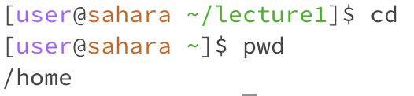
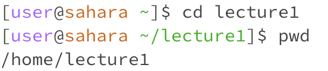
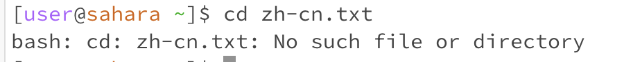
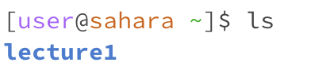
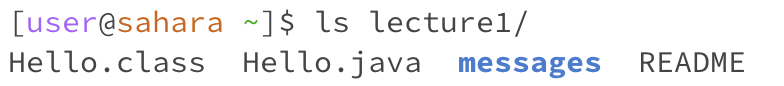
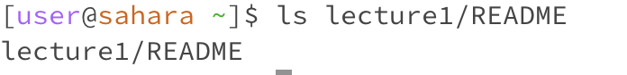
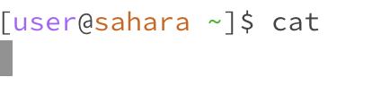
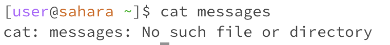
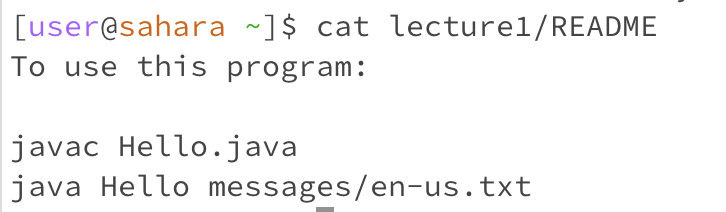

# Lab Report 1
## for cd command with no arguments.  
1,   
2, the directory is just /home This command will change the current directory to the home directory.  
3,  The command interprets the lack of arguments as an instruction to go to this default location.   
4, There is no error, since it goes back to the default location.  

-for cd with a path to a directory as an argument.  
1,   
2, directory is /home/lecture1  
3, The output of this command is not visible, but its effect is to change the current working directory to home/lecture1  
4, This is no an error, When this command is executed successfully, there's no output; the command silently changes the current directory to the specified path.   

-for cd command with a path to a file as an argument.  
1,   
2, No such file or directory.  
3, cd command does not work with file paths, only directories.  
4, It will result in an error because the command expects a directory path, not a file path.  

-for ls command with no arguments.  
1,   
2, it will show lecture1.  
3, When the ls command is executed without any arguments, it defaults to listing the contents of the current working directory.  
4, No error.  

-for ls with a path to a directory as an argument.  
1,   
2, contents of the lecture1 directory, Hello.class Hello.java messages README.  
3, The output we receive will be the names of all files and directories contained in Lecture1. The target of this command is Lecture1.  
4, No error.  

-for ls command with a path to a file as an argument.  
1,   
2, README file.  
3, The ls command can be used with file paths, but it doesn't list the contents of the file, just the file name if it exists.  
4, NO error.  

-for cat command with no arguments.  
1,   
2, no directories. since cat is not a directory.  
3, cat cannot be used on directories.  
4, Error, cat is used to read and display the content of files. It is not designed to handle directories.  

-for ls with a path to a directory as an argument.  
1,   
2, no directories, cat is not a directory.  
3, cat cannot be used on directories.  
4, Error, cat is used to read and display the content of files. It is not designed to handle directories.  

-for ls command with a path to a file as an argument.  
1,   
2, README file.  
3, the command reads and displays the content of the specified file. The cat command is designed for this purpose.  
4, no Error.  

