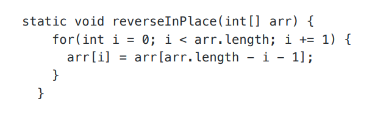

# Lab Report 3  
# Part 1 - Bugs  
Provide:  
- A failure-inducing input for the buggy program, as a JUnit test and any associated code (write it as a code block in Markdown)  
-An input that doesnʼt induce a failure, as a JUnit test and any associated code (write it as a code block in Markdown)  
-The symptom, as the output of running the tests (provide it as a screenshot of running JUnit with at least the two inputs above)  
-The bug, as the before-and-after code change required to fix it (as two code blocks in Markdown) Briefly describe why the fix addresses the issue.  
1. A failure-inducing input for the buggy program, as a JUnit test and any associated code (write it as a code block in Markdown).  
JUnit Test:

Associated Code:  
 

2. An input that doesnʼt induce a failure, as a JUnit test and any associated code (write it as a
code block in Markdown)
  JUnit Test:

Associated Code:  
 

3. -The symptom

4. The Bug.
   Before Code:
   
After Code:
  
