# Lab Report 3  
# Part 1 - Bugs  
Provide:  
- A failure-inducing input for the buggy program, as a JUnit test and any associated code (write it as a code block in Markdown)  
-An input that doesnʼt induce a failure, as a JUnit test and any associated code (write it as a code block in Markdown)  
-The symptom, as the output of running the tests (provide it as a screenshot of running JUnit with at least the two inputs above)  
-The bug, as the before-and-after code change required to fix it (as two code blocks in Markdown) Briefly describe why the fix addresses the issue.  
1. A failure-inducing input for the buggy program, as a JUnit test and any associated code (write it as a code block in Markdown).
 
JUnit Test:  
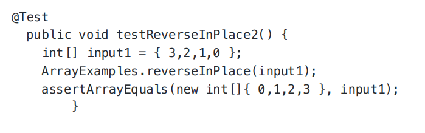

Associated Code:  
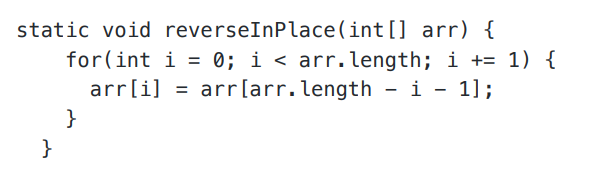 

2. An input that doesnʼt induce a failure, as a JUnit test and any associated code (write it as a
code block in Markdown)
  JUnit Test:
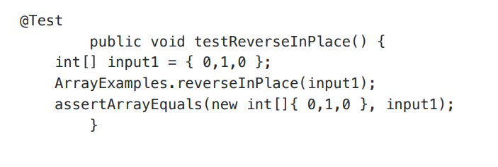

Associated Code:  
   

3. -The symptom  
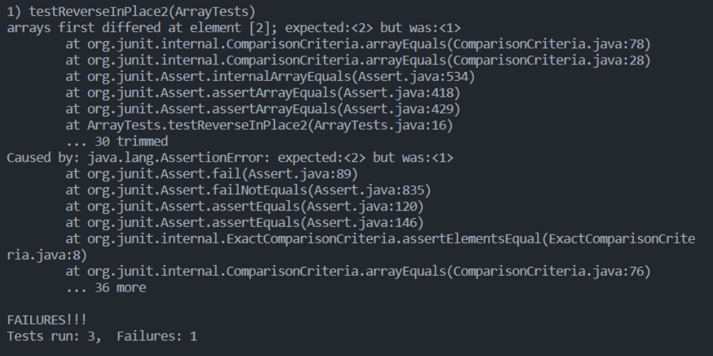  

4. The Bug.  
Before Code:  
     
After Code:  
  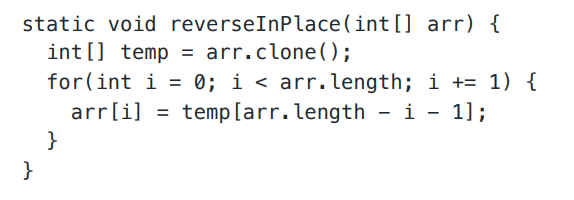

Briefly describe why the fix addresses the issue.  
The problem with the code lies in its limitation to only modify the first half of the array. This occurs due to its reliance on the expression arr[arr.length - i - 1], which results in altering the array beginning from the last element towards the first, sequentially. Consequently, this approach leads to an issue where it inadvertently replaces values with those previously replaced. For instance, transforming an array like {1,2,3,4} initially to {4,2,3,4} and then to {4,3,3,4}, the final two elements remain unchanged because it substitutes the value at index 2 with that at index 1, and the value at index 3 with that at index 0, effectively leaving the array with 3 replacing 3 and 4 replacing 4, thus only the first half of the array appears to be reversed. To rectify this, a solution was implemented involving the creation of a temporary array to hold the original array's values. This allows for the reversal of each segment of the array from this temporary storage, ensuring the use of unmodified values for replacement in the actual array based on indices derived from the temporary array. This step is crucial for achieving the desired array reversal without the aforementioned issue.  

# Part 2 - Researching Commands  
Using command find find can be used to find files and directories and perform operations on
them.  
1. Example 1,- find chapter-1.txt.  
  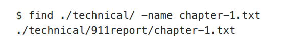

In this scenario, the process involves searching for the file named "chapter-1.txt" within the "./technical" directory. The result of this search indicates the exact location of the file, which is "./technical/911report/chapter1.txt". This functionality is beneficial as it assists in pinpointing the precise location of the desired file within the directory structure.  

2. Example 2 - find *.txt in ./911report  
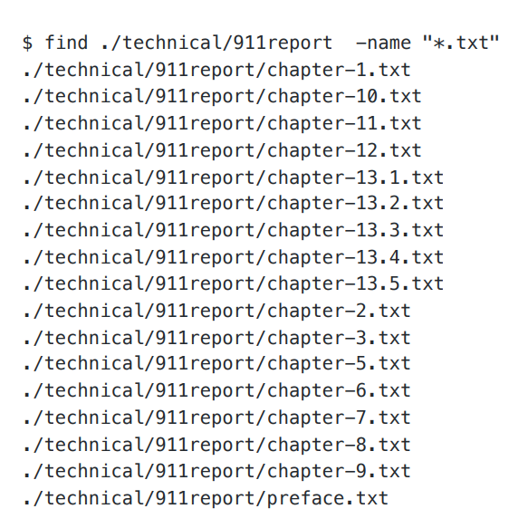  
   We can see that using -name with a *.txt can find us all the txt files in the directory that you
want to find in. In this case, we are finding all the txt files in ./technical/911report , and we are
shown all the txt files inside it. This is useful because we can find all the txt files that are contained
in a folder and know what they are.

3. -type in find Example 1 - find all the directories in the specified directory  
   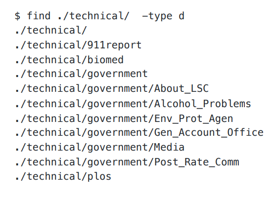  
   In this case, we used --type d to find all the directories inside of ./technical . This is
useful because we can use -type d to find all the directories inside the directory we want
and know what they are.

4. Example 2 - find all the files in a specific directory  
  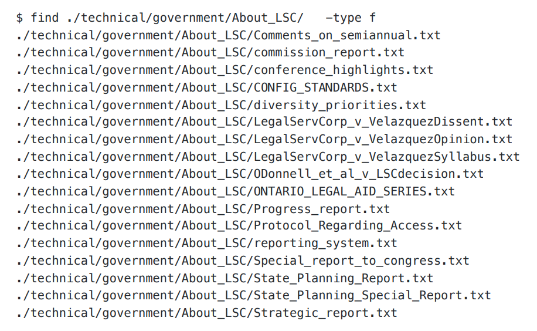  
  In this case, we used -type f to find the files in ./technical/government/About_LSC/ . This is
useful because we can use this method to find all the files that are inside a specific directory.

5. -mtime in find Example 1 - using -mtime -7 to find the files in a directory that is modified within the last 7 days  
  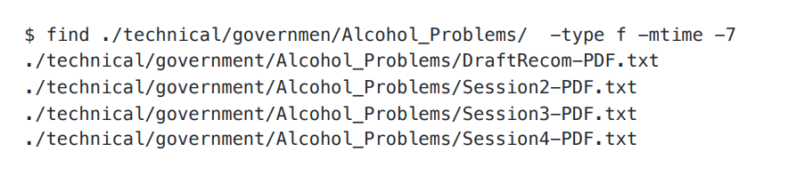  
  We can see that by using -mtime -7 , it prints out all the files that are modified in the last 7
days. This is useful because it can show use what files are modified in a specific range of time
in a directory.  

6. Example 2 - using -mtime +30 to find the files in a directory that is modified more than 30 days  
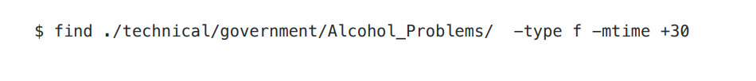   
   We can see that by using mtime +30 , nothing prints out because all the files are added today, so
no files more modified more than 30 days ago. This is useful because it can tell use what time
range was the file modified.  

7. -size in find We can use size to finds files that have different sizes. For example -size
1000c means a files that is exactly 1000 bytes. We can add -/+ to tell it to find files that are
smaller or loger than the size you want. Tips: c is fore bytes, k is for kilobytes, M is for
megabytes, and G is for gigabytes. Example 1 - using -size -1000c to find files that are
smalled than 1000 bytes  
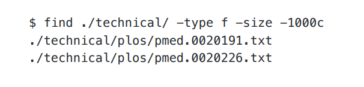  
 In this case, we used -size -1000c to find the files that are smaller than 1000 bytes in the side
of the ./technical/ directory. This is useful because we can use this command to find files
that are smaller than a specific size range.  

8. Example 2 - using -size +100k to find files that are larger than 100 kilobytes  
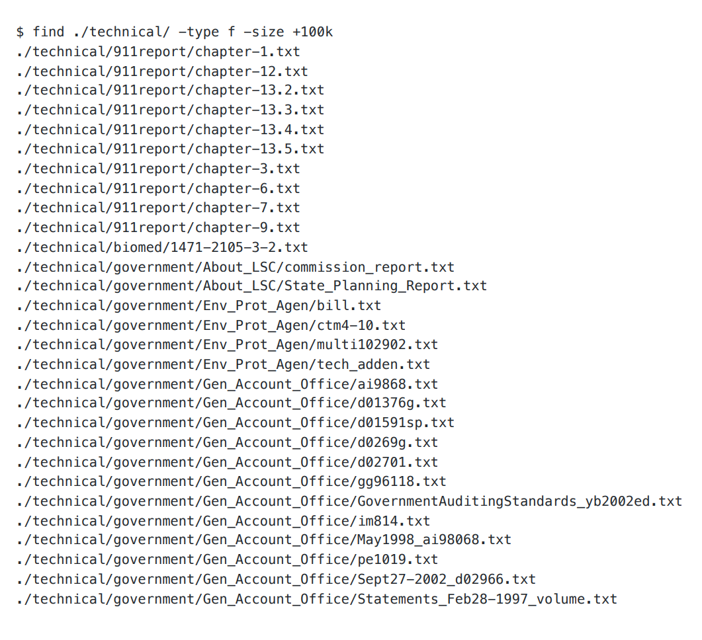  
  In this case, we used -size +100k to find the files that are larger than 100 kilobytes inside of
./technical/ directory. This is useful because it can let us know what files are bigger than a
certain range inside a directory we want to know.  

# Sources:
1. https://www.geeksforgeeks.org/find-command-in-linux-with-examples/
2. Using ChatGPT
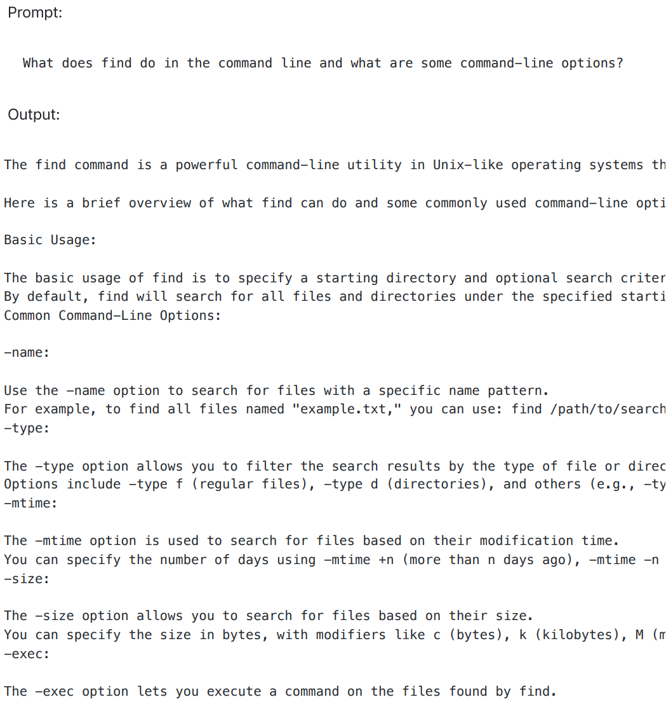
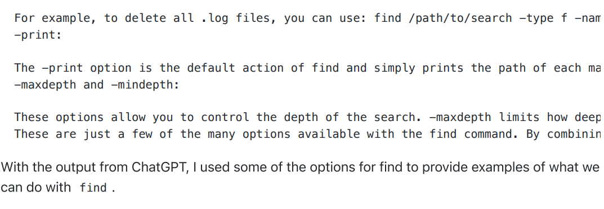 
