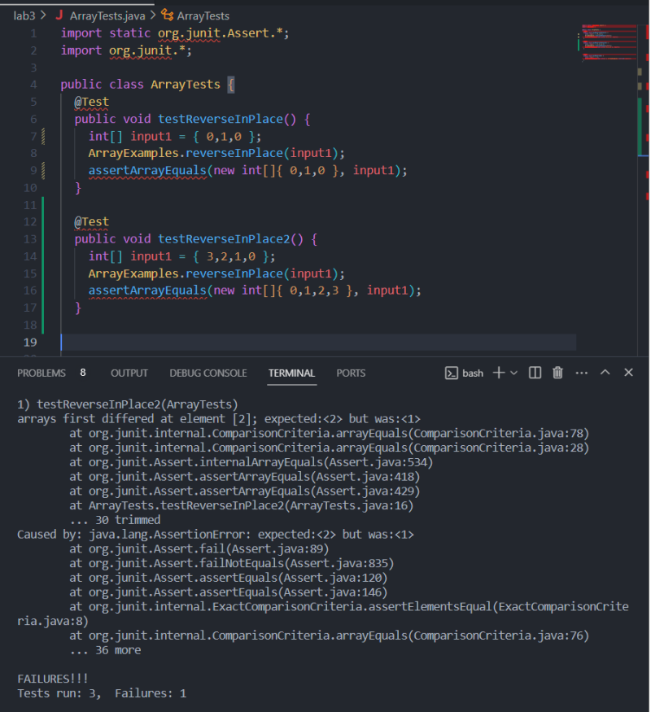
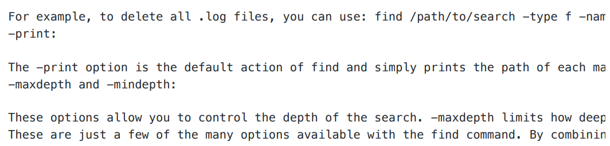

# Lab Report 3  
# Part 1 - Bugs  
Provide:  
- A failure-inducing input for the buggy program, as a JUnit test and any associated code (write it as a code block in Markdown)  
- An input that doesnʼt induce a failure, as a JUnit test and any associated code (write it as a code block in Markdown)  
- The symptom, as the output of running the tests (provide it as a screenshot of running JUnit with at least the two inputs above)  
- The bug, as the before-and-after code change required to fix it (as two code blocks in Markdown) Briefly describe why the fix addresses the issue.  
   
1. A failure-inducing input for the buggy program, as a JUnit test and any associated code (write it as a code block in Markdown).
```java
// JUnit Test
@Test
public void testReverseInPlace2() {
    int[] input1 = { 3,2,1,0 };
    ArrayExamples.reverseInPlace(input1);
    assertArrayEquals(new int[]{ 0,1,2,3 }, input1);
}
```
// Associated Code
```java
static void reverseInPlace(int[] arr) {
    for(int i = 0; i < arr.length; i += 1) {
        arr[i] = arr[arr.length - i - 1];
    }
}
```
2. An input that doesnʼt induce a failure, as a JUnit test and any associated code (write it as a
code block in Markdown)JUnit Test:
```java
@Test
public void testReverseInPlace() {
    int[] input1 = { 0,1,0 };
    ArrayExamples.reverseInPlace(input1);
    assertArrayEquals(new int[]{ 0,1,0 }, input1);
}  
```
Associated Code:  
```java
static void reverseInPlace(int[] arr) {
    for(int i = 0; i < arr.length; i += 1) {
        arr[i] = arr[arr.length - i - 1];
    }
}
```
3. -The symptom  
  

4. The Bug.  
Before Code:
```java
static void reverseInPlace(int[] arr) {
    for(int i = 0; i < arr.length; i += 1) {
        arr[i] = arr[arr.length - i - 1];
    }
}
```
After Code:  
```java
static void reverseInPlace(int[] arr) {
    for(int i = 0; i < arr.length / 2; i++) {
        int temp = arr[i];
        arr[i] = arr[arr.length - i - 1];
        arr[arr.length - i - 1] = temp;
    }
}
```

Briefly describe why the fix addresses the issue.  
The original code had a mistake because it was trying to flip the array's elements around directly in the array itself. While doing this, it ended up messing up the order because it was changing the numbers too early, so by the time it got to the end of the array, it was just copying the new numbers it had already put in, not the old ones it was supposed to. This is why the results were mixed up. The corrected code solves the problem by creating a copy of the original array, which is called temp. As it goes through the original array, it places the values from temp into the original array in reverse order. This method works because it keeps the original numbers safe in temp while it changes the original array. This way, the numbers that haven't been moved yet don't get changed by accident, which was the issue with the first version of the code. Now, the function can reverse the array correctly because it uses the unchanged values from temp to update the original array.  

# Part 2 - Researching Commands  
Using command find find can be used to find files and directories and perform operations on them.  
1. Example 1 find command is being used to search within the ./technical/ directory for a file specifically named chapter-1.txt.
```java
  $ find ./technical/ -name chapter-1.txt
./technical/911report/chapter-1.txt
```

In this scenario, the process involves searching for the file named "chapter-1.txt" within the "./technical" directory. The result of this search indicates the exact location of the file, which is "./technical/911report/chapter1.txt". This functionality is beneficial as it assists in pinpointing the precise location of the desired file within the directory structure.  

2. Example 2 - find *.txt in ./911report
```java
$ find ./technical/911report -name "*.txt"
./technical/911report/chapter-1.txt
./technical/911report/chapter-10.txt
./technical/911report/chapter-11.txt
./technical/911report/chapter-12.txt
./technical/911report/chapter-13.1.txt
./technical/911report/chapter-13.2.txt
./technical/911report/chapter-13.3.txt
./technical/911report/chapter-13.4.txt
./technical/911report/chapter-13.5.txt
./technical/911report/chapter-2.txt
./technical/911report/chapter-3.txt
./technical/911report/chapter-5.txt
./technical/911report/chapter-6.txt
./technical/911report/chapter-7.txt
./technical/911report/chapter-8.txt
./technical/911report/chapter-9.txt
./technical/911report/preface.txt
```
   We can see that using -name with a *.txt can find us all the txt files in the directory that you
want to find in. In this case, we are finding all the txt files in ./technical/911report , and we are
shown all the txt files inside it. This is useful because we can find all the txt files that are contained
in a folder and know what they are.

4. -type in find Example 1 - find all the directories in the specified directory
```java
$ find ./technical/ -type d
./technical/
./technical/911report
./technical/biomed
./technical/government
./technical/government/About_LSC
./technical/government/Alcohol_Problems
./technical/government/Env_Prot_Agen
./technical/government/Gen_Account_Office
./technical/government/Media
./technical/government/Post_Rate_Comm
./technical/plos
```
   In this case, we used --type d to find all the directories inside of ./technical . This is
useful because we can use -type d to find all the directories inside the directory we want
and know what they are.

5. Example 2 - find all the files in a specific directory  
```java
$ find ./technical/government/About_LSC/ -type f
./technical/government/About_LSC/Comments_on_semiannual.txt
./technical/government/About_LSC/commission_report.txt
./technical/government/About_LSC/conference_highlights.txt
./technical/government/About_LSC/CONFIG_STANDARDS.txt
./technical/government/About_LSC/diversity_priorities.txt
./technical/government/About_LSC/LegalServCorp_v_VelazquezDissent.txt
./technical/government/About_LSC/LegalServCorp_v_VelazquezOpinion.txt
./technical/government/About_LSC/LegalServCorp_v_VelazquezSyllabus.txt
./technical/government/About_LSC/ODonnell_et_al_v_LSCdecision.txt
./technical/government/About_LSC/ONTARIO_LEGAL_AID_SERIES.txt
./technical/government/About_LSC/Progress_report.txt
./technical/government/About_LSC/Protocol_Regarding_Access.txt
./technical/government/About_LSC/reporting_system.txt
./technical/government/About_LSC/Special_report_to_congress.txt
./technical/government/About_LSC/State_Planning_Report.txt
./technical/government/About_LSC/State_Planning_Special_Report.txt
./technical/government/About_LSC/Strategic_report.txt
```

  In this case, we used -type f to find the files in ./technical/government/About_LSC/ . This is
useful because we can use this method to find all the files that are inside a specific directory.

6. -mtime in find Example 1 - using -mtime -7 to find the files in a directory that is modified within the last 7 days  
```java
$ find ./technical/government/Alcohol_Problems/ -type f -mtime -7
./technical/government/Alcohol_Problems/DraftRecom-PDF.txt
./technical/government/Alcohol_Problems/Session2-PDF.txt
./technical/government/Alcohol_Problems/Session3-PDF.txt
./technical/government/Alcohol_Problems/Session4-PDF.txt
```

By employing the -mtime -7 command, it lists all files that have been modified within the past 7 days. This method is beneficial as it enables us to identify which files have been modified within a particular time frame in a directory.  

7. Example 2 - using -mtime +30 to find the files in a directory that is modified more than 30 days  
```java
$ find ./technical/government/Alcohol_Problems/ -type f -mtime +30
``` 
   We can see that by using mtime +30 , nothing prints out because all the files are added today, so
no files more modified more than 30 days ago. This is useful because it can tell use what time
range was the file modified.  

8. -size in find We can use size to finds files that have different sizes. For example -size
1000c means a files that is exactly 1000 bytes. We can add -/+ to tell it to find files that are
smaller or loger than the size you want. Tips: c is fore bytes, k is for kilobytes, M is for
megabytes, and G is for gigabytes. Example 1 - using -size -1000c to find files that are
smalled than 1000 bytes  
```java
$ find ./technical/ -type f -size -1000c
./technical/plos/pmed.0020191.txt
./technical/plos/pmed.0020226.txt
```
 In this scenario, we employed the -size -1000c command to locate files within the ./technical/ directory that are less than 1000 bytes. This method is advantageous for identifying files that fall below a predetermined size limit.  

9. Example 2 - using -size +100k to find files that are larger than 100 kilobytes  
```java
$ find ./technical/ -type f -size +100k
./technical/911report/chapter-1.txt
./technical/911report/chapter-12.txt
./technical/911report/chapter-13.2.txt
./technical/911report/chapter-13.3.txt
./technical/911report/chapter-13.4.txt
./technical/911report/chapter-13.5.txt
./technical/911report/chapter-3.txt
./technical/911report/chapter-6.txt
./technical/911report/chapter-7.txt
./technical/911report/chapter-9.txt
./technical/biomed/1471-2105-3-2.txt
./technical/government/About_LSC/commission_report.txt
./technical/government/About_LSC/State_Planning_Report.txt
./technical/government/Env_Prot_Agen/bill.txt
./technical/government/Env_Prot_Agen/ctm4-10.txt
./technical/government/Env_Prot_Agen/multi102902.txt
./technical/government/Env_Prot_Agen/tech_adden.txt
./technical/government/Gen_Account_Office/ai9868.txt
./technical/government/Gen_Account_Office/d01376g.txt
./technical/government/Gen_Account_Office/d0159lsp.txt
./technical/government/Gen_Account_Office/d0269g.txt
./technical/government/Gen_Account_Office/d02701.txt
./technical/government/Gen_Account_Office/gg96118.txt
./technical/government/Gen_Account_Office/GovernmentAuditingStandards_yb2002ed.txt
./technical/government/Gen_Account_Office/im814.txt
./technical/government/Gen_Account_Office/May1998_ai98068.txt
./technical/government/Gen_Account_Office/pe1019.txt
./technical/government/Gen_Account_Office/Sept27-2002_d02966.txt
./technical/government/Gen_Account_Office/Statements_Feb28-1997_volume.txt
```
 In this instance, we utilized the command -size +100k to identify files exceeding 100 kilobytes in size within the ./technical/ directory. This approach is beneficial as it allows us to determine which files surpass a specific size threshold within a directory of interest.  

# Sources:
1. https://www.geeksforgeeks.org/find-command-in-linux-with-examples/
2. Using ChatGPT

   
With the output from ChatGPT, I used some of the options for find to provide examples of what wecan do with find .
