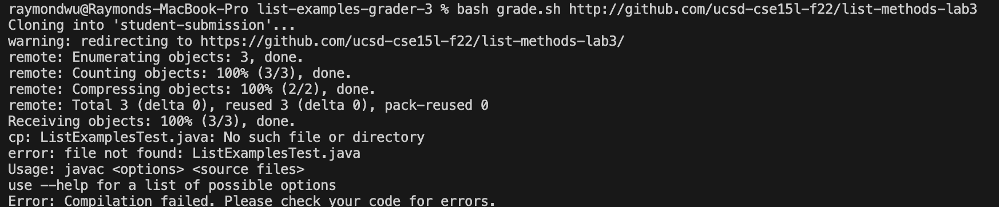
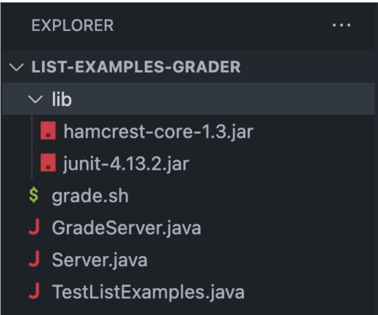
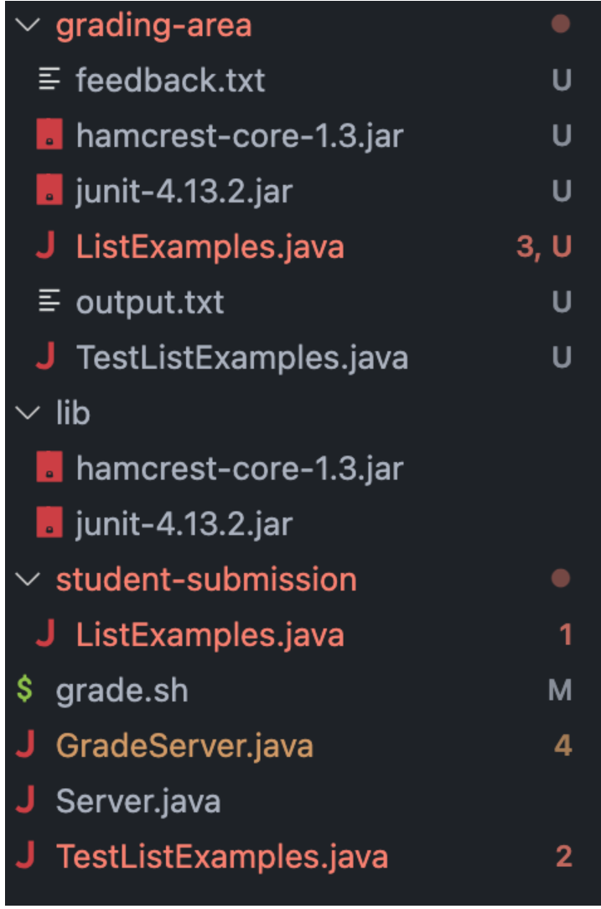

# Lab Report 5 - Putting it All Together (Week 9)
## Part 1 – Debugging Scenario
### Studentʼs post
Hi, I have a problem when I am working on the List-Examples-Grader, and I cannot find out how to
resolve the issue. I have a few guesses of what might cause the failure.
Here is the output of the error:  
   
Here is the code for the grade.sh file:  
```java
CPATH='.:lib/hamcrest-core-1.3.jar:lib/junit-4.13.2.jar'

rm -rf student-submission
rm -rf grading-area

mkdir grading-area

git clone $1 student-submission
echo 'Finished cloning'


# Draw a picture/take notes on the directory structure that's set up after
# getting to this point

# Then, add here code to compile and run, and do any post-processing of the
# tests
files=`find student-submission/*.java`
for file in $files
do
    if [[ -f $file ]] && [[ $file == *ListExamples* ]]
    then echo 'Correct file is submitted.'
    else echo 'File NOT submitted correctly!!!'
    fi 
done

cp student-submission/ListExamples.java grading-area
cp TestListExamples.java grading-area
cp -r lib/ grading-area
cd grading-area
javac -cp .:lib/hamcrest-core-1.3.jar:lib/junit-4.13.2.jar *.java 2> feedback.txt
java -cp .:lib/hamcrest-core-1.3.jar:lib/junit-4.13.2.jar org.junit.runner.JUnitCore TestListExamples >output.txt
```
Here is the directory before running the code:
   

Here is the directory after running the code:
   

Description: I use ```bash grade.sh https://github.com/ucsd-cse15l-f22/list-methods-lab3``` for the input in the terminal. After running the code, I see that it created a folder called ```grading-area```, where it clones the student submission file ```TestListExamples.java``` and provides feedback with ```feedback.txt``` and ```output.txt```, it also clones the two files from the ```lib``` folder. The problem that might cause the error is that there are two ```ListExmaples.java```, and it can not find the main class to run it.  

### TA’s Respond:  

### Student’s Respond:  
Hi, after going through your suggestion, I found the problem and was able to fix it. I discovered that when I am copying the lib files, I only copy the files but not the folder. This will cause that problem when using ```javac``` and ```java``` because in those two lines, it finds the two files from the ```lib``` folder, but it does not exist in the ```grading-area folder``. Therefore, it will cause the problem of not being able to find the file. The fix was changing the line cp -r lib\ grading-area to ``cp -r lib grading-area```, by removing the ```\```, it will copy the entire folder, including the folder It will allow the later lines to find where two use the lib files.

Here is the fix code:
```
CPATH='.:lib/hamcrest-core-1.3.jar:lib/junit-4.13.2.jar'

rm -rf student-submission
rm -rf grading-area

mkdir grading-area

git clone $1 student-submission
echo 'Finished cloning'


# Draw a picture/take notes on the directory structure that's set up after
# getting to this point

# Then, add here code to compile and run, and do any post-processing of the
# tests
files=`find student-submission/*.java`
for file in $files
do
    if [[ -f $file ]] && [[ $file == *ListExamples* ]]
    then echo 'Correct file is submitted.'
    else echo 'File NOT submitted correctly!!!'
    fi 
done

cp student-submission/ListExamples.java grading-area
cp TestListExamples.java grading-area
cp -r lib grading-area
cd grading-area
javac -cp .:lib/hamcrest-core-1.3.jar:lib/junit-4.13.2.jar *.java 2> feedback.txt
java -cp .:lib/hamcrest-core-1.3.jar:lib/junit-4.13.2.jar org.junit.runner.JUnitCore TestListExamples >output.txt
```
And here is the output in the output.txt file:  
```
JUnit version 4.13.2
.E
Time: 0.525
There was 1 failure:
1) testMergeRightEnd(TestListExamples)
org.junit.runners.model.TestTimedOutException: test timed out after 500 milliseconds
	at java.base/java.lang.System.arraycopy(Native Method)
	at java.base/java.util.Arrays.copyOf(Arrays.java:3515)
	at java.base/java.util.Arrays.copyOf(Arrays.java:3482)
	at java.base/java.util.ArrayList.grow(ArrayList.java:237)
	at java.base/java.util.ArrayList.grow(ArrayList.java:244)
	at java.base/java.util.ArrayList.add(ArrayList.java:483)
	at java.base/java.util.ArrayList.add(ArrayList.java:496)
	at ListExamples.merge(ListExamples.java:42)
	at TestListExamples.testMergeRightEnd(TestListExamples.java:17)

FAILURES!!!
Tests run: 1,  Failures: 1
```
This shows that it works because the file ```https://github.com/ucsd-cse15l-f22/list-methods-lab3```was suppose to fail in this case.  

### All the information needed
-The file & directory structure needed:  
  
-The contents of each file before fixing the bug  
grade.sh:  
```
CPATH='.:lib/hamcrest-core-1.3.jar:lib/junit-4.13.2.jar'

rm -rf student-submission
rm -rf grading-area

mkdir grading-area

git clone $1 student-submission
echo 'Finished cloning'


# Draw a picture/take notes on the directory structure that's set up after
# getting to this point

# Then, add here code to compile and run, and do any post-processing of the
# tests
files=`find student-submission/*.java`
for file in $files
do
    if [[ -f $file ]] && [[ $file == *ListExamples* ]]
    then echo 'Correct file is submitted.'
    else echo 'File NOT submitted correctly!!!'
    fi 
done

cp student-submission/ListExamples.java grading-area
cp TestListExamples.java grading-area
cp -r lib/ grading-area
cd grading-area
javac -cp .:lib/hamcrest-core-1.3.jar:lib/junit-4.13.2.jar *.java 2> feedback.txt
java -cp .:lib/hamcrest-core-1.3.jar:lib/junit-4.13.2.jar org.junit.runner.JUnitCore TestListExamples >output.txt
```

TestListExamples.java:  
```
import static org.junit.Assert.*;
import org.junit.*;
import java.util.Arrays;
import java.util.List;

class IsMoon implements StringChecker {
  public boolean checkString(String s) {
    return s.equalsIgnoreCase("moon");
  }
}

public class TestListExamples {
  @Test(timeout = 500)
  public void testMergeRightEnd() {
    List<String> left = Arrays.asList("a", "b", "c");
    List<String> right = Arrays.asList("a", "d");
    List<String> merged = ListExamples.merge(left, right);
    List<String> expected = Arrays.asList("a", "a", "b", "c", "d");
    assertEquals(expected, merged);
  }
}
```
-The full command line (or lines) you ran to trigger the bug
```bash grade.sh https://github.com/ucsd-cse15l-f22/list-methods-lab3 cp -r lib\ grading-area```
-A description of what to edit to fix the bug  
To fix the bug, we need to copy the entire ```lib```folder instead of only the files inside the ```lib```folder. Therefore, we need to change the line ```cp -r lib\ grading-area``` to ```cp -r lib grading-area```

-Here is the final code for the ```grade.sh``` file:
```
CPATH='.:lib/hamcrest-core-1.3.jar:lib/junit-4.13.2.jar'

rm -rf student-submission
rm -rf grading-area

mkdir grading-area

git clone $1 student-submission
echo 'Finished cloning'


# Draw a picture/take notes on the directory structure that's set up after
# getting to this point

# Then, add here code to compile and run, and do any post-processing of the
# tests
files=`find student-submission/*.java`
for file in $files
do
    if [[ -f $file ]] && [[ $file == *ListExamples* ]]
    then echo 'Correct file is submitted.'
    else echo 'File NOT submitted correctly!!!'
    fi 
done

cp student-submission/ListExamples.java grading-area
cp TestListExamples.java grading-area
cp -r lib grading-area
cd grading-area
javac -cp .:lib/hamcrest-core-1.3.jar:lib/junit-4.13.2.jar *.java 2> feedback.txt
java -cp .:lib/hamcrest-core-1.3.jar:lib/junit-4.13.2.jar org.junit.runner.JUnitCore TestListExamples >output.txt
```
## Part 2 – Reflection
In the second part of the quarter in the lab, I learned about a tool called vim. I think vim is really cool because it lets us change code right in the terminal without having to open the file in a code editor. Vim is handy when we want to edit code on our computer and connect to a remote server. It's easy because we don't have to download the file or look for other ways to copy and fix it. We can just open and edit it in the terminal.  
