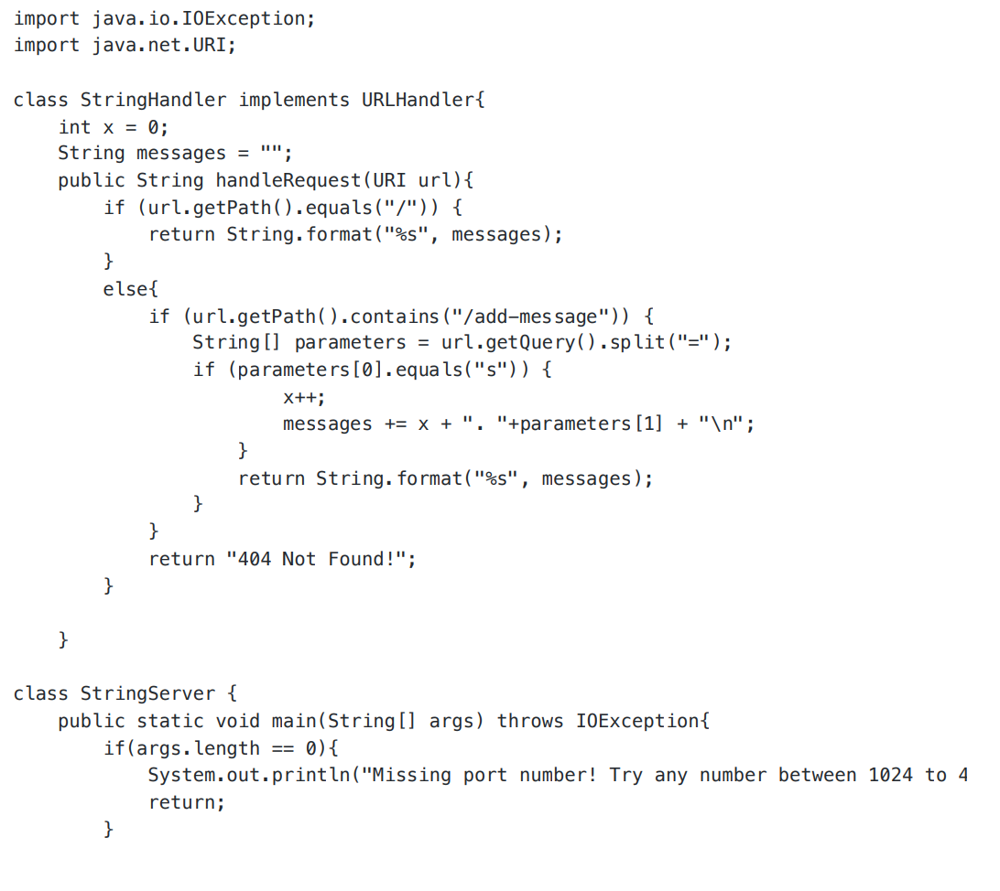
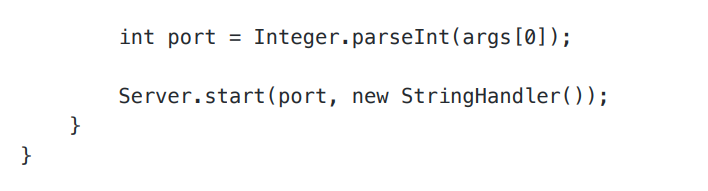
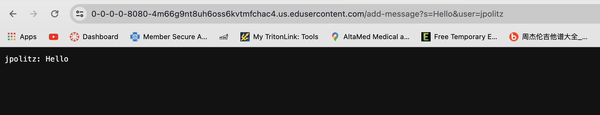
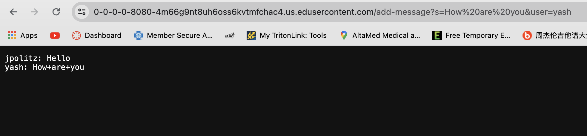
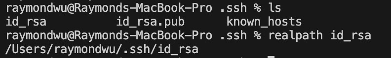
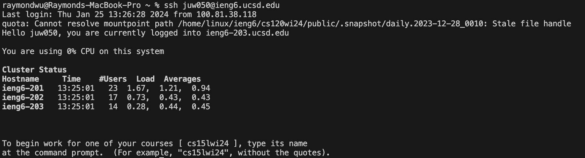

# Lab Report 2
## Part 1
### code for ChatServer
   
  
### two screenshots of using /add-message   
  
1. The method is called: public String handleRequest(URI url) .  
2. The relevant argument is the URL that is passed through in the method, which in this case is The values that are used from the class are int x , and String messages.
3. The values that changed are int x and String messages . int x increased from 0 to 1, by x++; . And String messages changed from "" to "1. Hello" , by messages += x + "."+parameters[1] + "\n"; . The reason that they changed is that the method gets the URL and finds the path /add-messages , adds the string that is typed in with parameter [1] adds it into messages, and increases the number in front by 1.

     
1. The method is called: public String handleRequest(URI url) .
2. The relevant argument is the URL that is passed through in the method, which in this case is The values that are used from the class are int x , and String messages
3. The changed values are int x and String messages . int x increase from 1 to 2, by x++; . And String messages changed from "1. Hello" to "1. Hello\n 2. How+are+you" , by messages += x +"."+parameters[1] + "\n"; . The reason that they changed is the same as screenshot 1.

## Part 2  
### The absolute path to the private key for your SSH key for logging into ieng6
  
.ssh/id_rsa

### The absolute path to the public key for your SSH key for logging into ieng6
  

### A terminal interaction where you log into your ieng6 account without being asked for a password.
  

## Part 3  
During the lab in week 2, I learned the process of secure remote login to a server using SSH (Secure Shell) from the EdStem lab environment. Before this lab, I wasn't aware of how to utilize SSH keys for authentication, which is a secure alternative to using passwords, and the specific commands to establish a connection to the server. I also learned how to generate an SSH key pair, store the private key securely in my EdStem workspace, and copy the public key to the server's authorized_keys file to enable passwordless login, which was a crucial aspect of server management and security that I had not been exposed to before.

