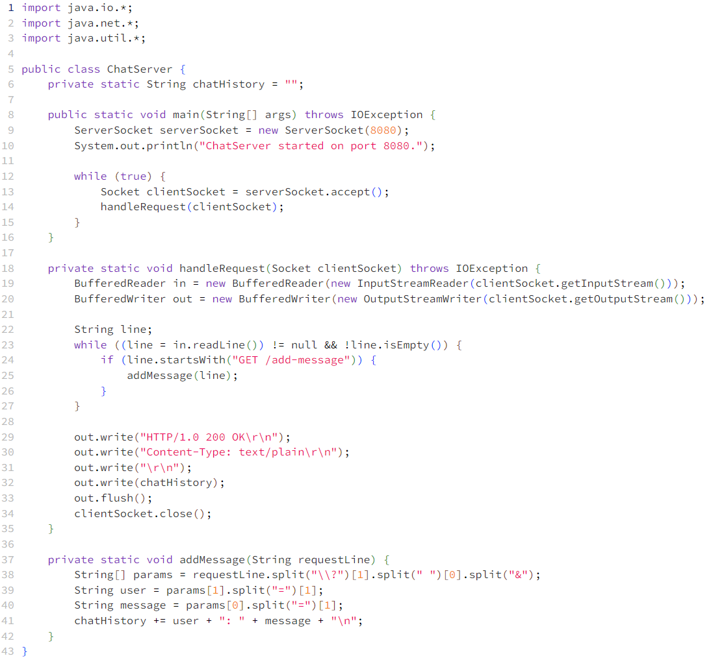

# Lab Report 2
## code for ChatServer  
   
## two screenshots of using /add-message   
  
1. handle method of the MessageHandler class is called by the HttpServer when the /add-message context is accessed.
2. The HttpExchange object exchange is passed as a parameter to the handle method.
3. The static chatHistory field in the ChatServer class would change by having the string "jpolitz: Hello\n" appended to it.

     
1. the handle method of the MessageHandler class is called.
2. The HttpExchange object exchange is again the argument to the handle method.
3. The chatHistory field would be further appended with "yash: How are you\n".

## Using the command line, show with ls and take screenshots of:  
### The absolute path to the private key for your SSH key for logging into ieng6
   

### The absolute path to the public key for your SSH key for logging into ieng6
  

### A terminal interaction where you log into your ieng6 account without being asked for a password.
  
