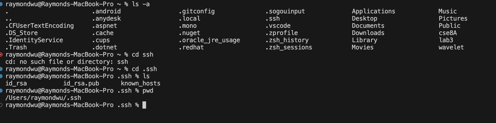

# Lab Report 2
## Part 1
### code for ChatServer  
   
### two screenshots of using /add-message   
  
1. handle method of the MessageHandler class is called by the HttpServer when the /add-message context is accessed.
2. The HttpExchange object exchange is passed as a parameter to the handle method.
3. The static chatHistory field in the ChatServer class would change by having the string "jpolitz: Hello\n" appended to it.

     
1. the handle method of the MessageHandler class is called.
2. The HttpExchange object exchange is again the argument to the handle method.
3. The chatHistory field would be further appended with "yash: How are you\n".

## Part 2  
### The absolute path to the private key for your SSH key for logging into ieng6
  
.ssh/id_rsa

### The absolute path to the public key for your SSH key for logging into ieng6
  

### A terminal interaction where you log into your ieng6 account without being asked for a password.
  

## Part 3  
During the lab in week 2, I learned the process of secure remote login to a server using SSH (Secure Shell) from the EdStem lab environment. Before this lab, I wasn't aware of how to utilize SSH keys for authentication, which is a secure alternative to using passwords, and the specific commands to establish a connection to the server. I also learned how to generate an SSH key pair, store the private key securely in my EdStem workspace, and copy the public key to the server's authorized_keys file to enable passwordless login, which was a crucial aspect of server management and security that I had not been exposed to before.

