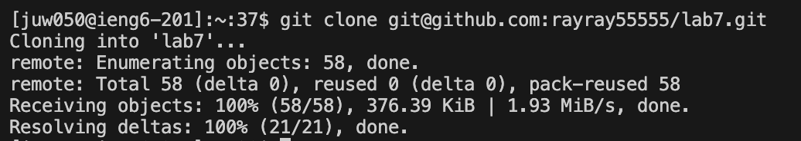
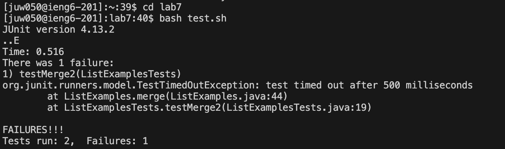
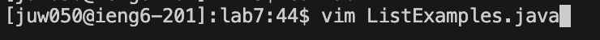
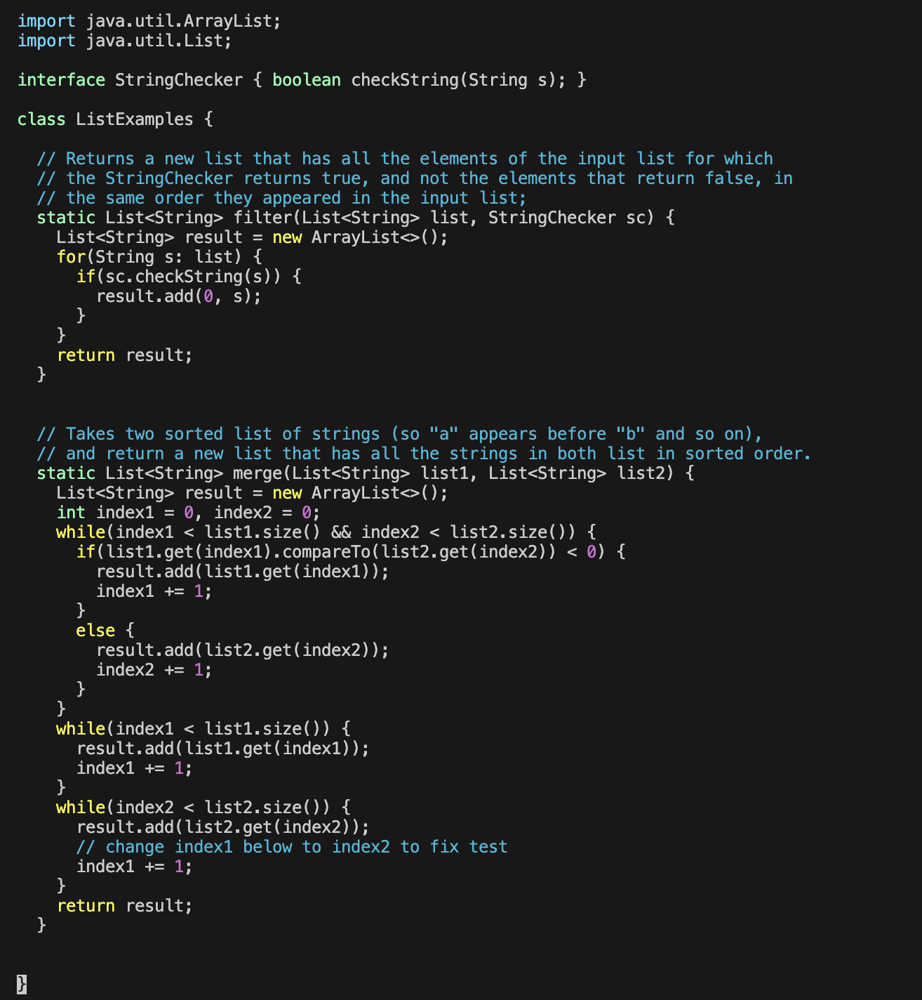
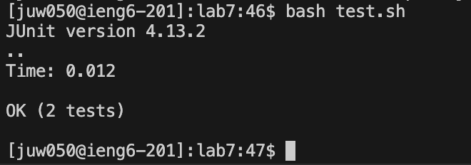
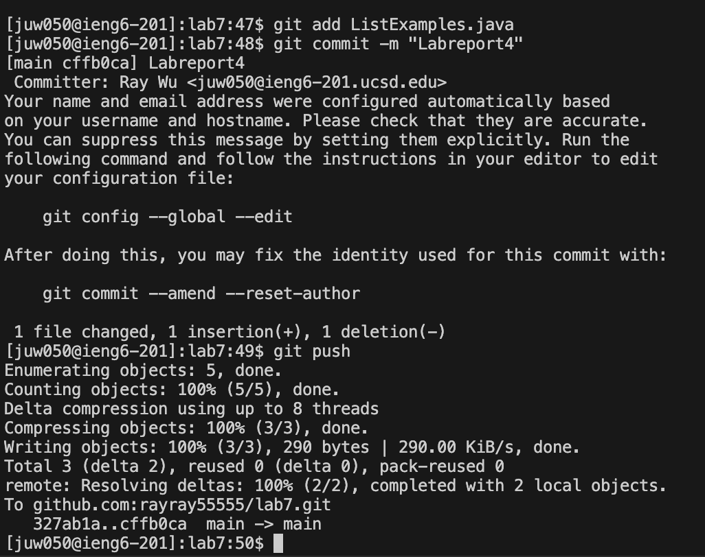

# Lab Report 4
## Step 4 - Log into ieng6
  
In this step, I used ssh to log into the remote server, account is juw050@ieng6.ucsd.edu for me.  

## Step 5 - - Clone your fork of the repository from your GitHub account (using the SSH URL)  
  
In this step, I clone the fork of the repository from my GitHub account using git clone with the address from ssh type fork.  

## Step 6 - Run the tests, demonstrating that they fail  
  
In this step, I used bash test.sh to run the test. It shows one failure out of the two test runs; therefore, this is a failure  

## Step 7 - Edit the code file to fix the failing test  
  
  
In this step, I used vim ListExamples.java to get into the file in the terminal using vim. The command was 34 lines down from the first line, so I did 34j to go down to the line that has index1 += 1; Press i to enter Insert mode where I can type and edit text. change index1 += 1; to index2 += 1;Press Esc to exit Insert mode. Type :wq to write the file and quit Vim. Therefore, after the keypresses, we went into the file and changed index1 to index2. and saved the file.  

## Step 8 - Run the tests, demonstrating that they now succeed
  
By running bash test.sh I can run the test, and it showed that both tests passed  

## Step 9 - Commit and push the resulting change to your GitHub account (you can pick any commit message!)

In this step, I did git add ListExamples.java to add the edited Java file into GitHub. Then I used git commit -m "LabReport4" to add a commit and say LabReport4 . Then, I used git push to push the file to GitHub. Therefore, after these steps, the file in now updated and in GitHub.  
