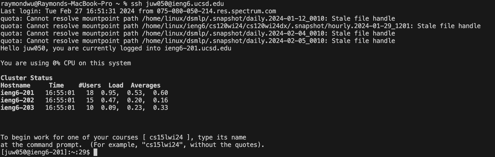

# Lab Report 4
## Step 4 - Log into ieng6
  
I press `<ssh>` and `<juw050@ieng6.ucsd.edu> <enter>`, becuase of I save the key on my computer so I it just let login without ask me the password.

## Step 5 - - Clone your fork of the repository from your GitHub account (using the SSH URL)  
  
I fork the repository on github and then copy the SSH URL from the repository and then I go back to terminal then I press `<git clone>` `<command+v> <enter>`then the repository successfully cloned to my ieng6. 

## Step 6 - Run the tests, demonstrating that they fail  
  
I press `<ls> <enter>` to check repository in my ieng6, and I use `<cd>` `<l>` `<tab> <enter>` to move to lab7/, and then `<ls> <enter>` to see files in lab7/, and then `<bash>` `<t> <tab> <enter>` to run the `test.sh`, and the demonstrate that the tests are fail.

## Step 7 - Edit the code file to fix the failing test  
  
  
I press `<vim> <L> <tab>` to vim mode to edit the `ListExamples.java` file
then I press `</> <index1> <enter>`to open the find mode and then I press `<n>` untill find the right `index1`that we need to change to `index2`. After I find it, I press `<e>` to move to the last letter of the word which is `1` and then I press`<x>` to delete it and `<i>` to enter insert mode and press`<2>` to finish to change and press`<esc>`to exit the insert mode. And then I press`<:wq> <enter>` to save and exit vim mode.  

## Step 8 - Run the tests, demonstrating that they now succeed
  
I press `<bash> <t> <tab> <enter>` and then the result of all test passed show on the screen.  

## Step 9 - Commit and push the resulting change to your GitHub account (you can pick any commit message!)

`<git add> <L> <tab> <enter>` to tell Git that I want to include updates to `ListExamples.java` in the next commit and then `<git commit -m "lab report4 fix bug in ListExamples.java"> <enter>` to commit the changes and add a commit message, and then `<git push> <enter>` to push the changes to the github repository.  

